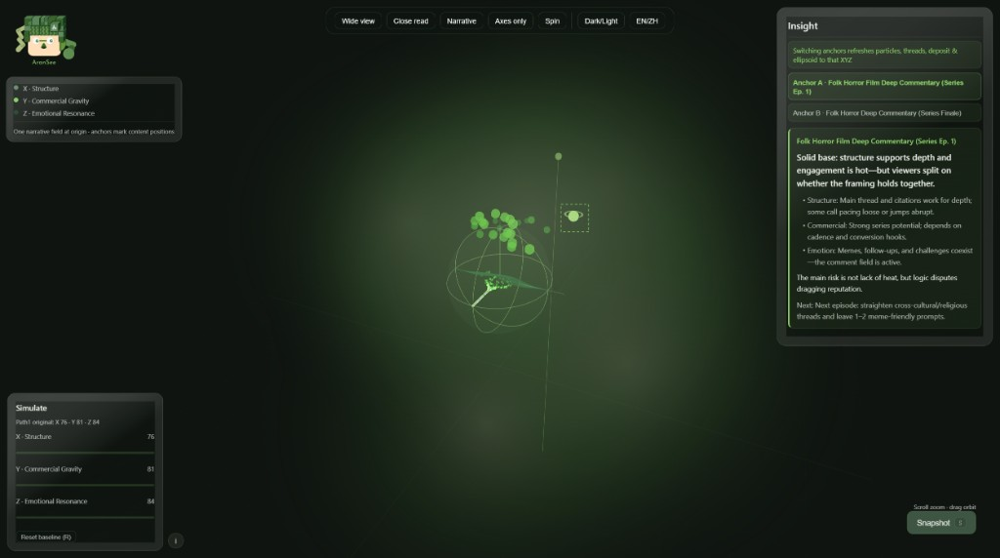

# aransee

**AranSee** 是面向创作者的 **AI 内容诊断产品**：把你的帖文与评论场翻译成 **X/Y/Z 三轴判断**，再用可交互 **2.5D 沙盘**把落位看得见。  
在 Cursor 里以 Skill 安装使用——**AI 负责读懂与打分，沙盘负责呈现与模拟**；不是 Chat 长报告，也不是纯 Agent 插件。

帮创作者针对**单条帖文 + 评论场**，完成结构 / 商业 / 情感落位、短洞察、策略模拟与 ROI 提示。

**AI 内容诊断** | **兼容 Cursor · Claude Code Skill** | **不是 Chat 长报告** | **分数驱动场域 · 可反复对照改稿**

<p align="center">
  
  
</p>
<p align="center"><sub>Googo 引领进场 · 暗色 / 亮色主题</sub></p>

---
## 和别的 AI 分析有什么不同

AranSee 把「AI 说了什么」变成「场子里落在哪」——模型输出先落成**协议化分数**，再驱动**确定性可视化**，而不是停留在对话框里。

1. **看得见** — 不是段落里扔一个总分，而是三轴空间里的落位：结构带、沉积场、共振流。  
2. **评论场第二层** — 解说、带货类内容，评论类型往往比正文更省成本、更能说明场子。  
3. **短而可执行** — 洞察 + 下一步 + ROI 一行，不做 PDF 式长报告。  
4. **可对照改稿** — 同一份 AI 诊断可反复进沙盘做策略模拟，看「如果某一轴变了，场子往哪偏」。
---

## AranSee 诊断 · Googo 引领

**AranSee**（AI 诊断层）给出三轴落位与策略含义；**Googo**（场内向导 IP）带你进场、读氛围——理性分数 + 感性引领。模拟滑块时场子会 react，像「策略试探」而不是再开一轮 Chat。

| 特质 | 含义 |
|------|------|
| **引领** | 在三轴空间里找位置，而不是只给一个抽象分数 |
| **勇敢** | 帖文、评论、表格都接得住（由你自备、脱敏） |
| **看得清** | 客观呈现场子，不站队、不对用户内容做道德审判 |

Googo 是 AranSee 创作者工具链中的视觉向导品牌，不是通用聊天人格。气质与边界见 [`docs/BRAND.md`](docs/BRAND.md)。
---

## 适用人群

| 内容形态 | 你会看清什么 |
|----------|----------------|
| 深度解说 / 影评 | 结构是否稳、评论场是追问还是玩梗 |
| 直播切片 / 情绪向 | 共鸣是否撑起传播、商业是否偏弱 |
| 清单干货 / 钩子向 | 结构带是否清晰、收藏动机来自哪一轴 |
| 收官带货 / 置顶转化 | 商业沉积是否加重、情感是否仍在线 |

> 当前展示案例以**中文自媒体帖文**为主；表格数据路径见 `prompts/score_table.system.md`。  
> **v1：一次只处理一条帖** — 每组 X/Y/Z（各 0–100），多条请分次诊断。

---

## 先看展示（无需安装）

### 在线试玩（GitHub Pages · 推荐）

推送公开仓后，在仓库 **Settings → Pages → Build from branch `main` → Folder `/docs`**。

| 展示 | Pages 路径（仓库名 `aransee` 时） |
|------|-----------------------------------|
| **系列双锚（推荐）** | `https://aranda-a.github.io/AranSee/demos/folk_daoxi_series_01/aransee_sandbox.html` |
| 入口导航 | `https://aranda-a.github.io/AranSee/demos/` |
| 旗舰单点 | `https://aranda-a.github.io/AranSee/demos/folk_film_commentary_01/aransee_sandbox.html` |

预烘焙 HTML 在 `docs/demos/`；更新后在本机运行：

```bash
python scripts/bake_github_demos.py --render
```

### 本地打开（克隆后）

| 展示 | 路径 |
|------|------|
| **系列双锚** | [`docs/demos/folk_daoxi_series_01/aransee_sandbox.html`](docs/demos/folk_daoxi_series_01/aransee_sandbox.html) |
| 旗舰单点 | [`docs/demos/folk_film_commentary_01/aransee_sandbox.html`](docs/demos/folk_film_commentary_01/aransee_sandbox.html) |

需联网加载 Three.js CDN。

<p align="center">
  
  
</p>
<p align="center"><sub>暗色 · 三轴场 + 洞察卡 + 模拟 ROI · 系列双锚切换</sub></p>

<p align="center">
  
  
</p>
<p align="center"><sub>亮色 · 近距读数 · 系列对比（收官锚点 B）</sub></p>

更多截图命名与备选见 [`release/github/demos/SCREENSHOTS.md`](release/github/demos/SCREENSHOTS.md)。

---

## 安装

本仓库遵循标准 **Claude Skill** 格式：`SKILL.md` + YAML frontmatter + `prompts/` + `references/`。

### Cursor

1. 克隆本仓库，或在 Cursor 中打开项目目录。  
2. Agent 会自动读取根目录 `AGENTS.md` 与 `SKILL.md`。  
3. 更新：在仓库目录执行 `git pull`。

### Claude Code

```bash
cd ~/.claude/skills   # 或你的 skills 目录
git clone https://github.com/Aranda-a/AranSee.git
```

下次启动 Claude Code 即可识别。

### 其他支持 Skill 的工具

按各工具文档，将本文件夹放到对应 skills 目录；**务必包含 `prompts/` 与 `references/`**。

---

## 使用方式

在对话中说明你要**复盘一条内容**，并粘贴帖文与评论摘要（或表格）。Skill 会按协议输出 `analysis.json`。

**示例 1**

```
帮我用 AranSee 复盘这条解说视频：结构、商业、情感各落在哪？
【粘贴：视频摘要 + 10 条代表性评论】
```

**示例 2**

```
这条清单帖的钩子够吗？评论里大家在夸什么、在质疑什么？
【粘贴：正文 + 评论摘录】
```

**输出是什么**

- 三轴分数：X 结构稳定性 · Y 商业转化重力 · Z 情感共鸣活性  
- 短洞察：`implication` + `next_step`（口语、可执行）  
- 字段契约：[`docs/DATA_CONTRACT.md`](docs/DATA_CONTRACT.md)  

**展示沙盘**：公开仓提供**预烘焙 HTML** 演示最终体验；自行本地重渲染需完整开发环境（渲染内核不在公开 Skill 包内，见 [`release/github/MANIFEST.md`](release/github/MANIFEST.md)）。

---

## 数据与合规

- **自备数据（BYOD）**：仅分析你有权使用的文本；AranSee 不提供、也不鼓励任何平台未授权爬取或批量抓取。  
- **展示案例**：脱敏样本 + 手动抽样；不含可复原链接、视频文件与全量评论库；**不出现创作者真名**。  
- **诊断 ≠ 转载**：输出为结构化判断，不是二次发行他人内容。  
- **样例场 ≠ 训练集**：公开案例仅供演示协议与沙盘，不授权作模型训练数据。

完整说明：[`docs/DATA_COMPLIANCE.md`](docs/DATA_COMPLIANCE.md)

---

## 保护原创性

| 措施 | 说明 |
|------|------|
| **商标** | AranSee、Googo 为品牌标识（见 [`NOTICE.md`](NOTICE.md)） |
| **协议版本** | 沙盘契约 `aransee.sandbox.v1`；改字段须升版本 |
| **分许可** | 代码与 Skill 文档 MIT；Googo 视觉资产 © AranSee |
| **公开 prompt** | 只写行为约束，不写内部原则名与加权公式 |
| **公开范围** | Skill + 协议 + 预烘焙 demo；渲染内核与评分基因不公开 |

---

## 文档

| 路径 | 说明 |
|------|------|
| [`SKILL.md`](SKILL.md) | Skill 协议与三轴说明 |
| [`AGENTS.md`](AGENTS.md) | Cursor 短入口 |
| [`prompts/`](prompts/) | 用户内容 → 诊断 JSON |
| [`docs/DATA_CONTRACT.md`](docs/DATA_CONTRACT.md) | 字段契约 |
| [`docs/PRODUCT_AXES.md`](docs/PRODUCT_AXES.md) | 三轴定义 |
| [`docs/PRODUCT_BOUNDARIES.md`](docs/PRODUCT_BOUNDARIES.md) | 产品边界 |
| [`docs/BRAND.md`](docs/BRAND.md) | AranSee + Googo |
| [`assets/cases/README.md`](assets/cases/README.md) | 展示案例说明 |
| [`release/github/MANIFEST.md`](release/github/MANIFEST.md) | 公开仓交付清单 |
| [`release/github/demos/SCREENSHOTS.md`](release/github/demos/SCREENSHOTS.md) | README 截图标准 |
| [`docs/DATA_COMPLIANCE.md`](docs/DATA_COMPLIANCE.md) | 数据、版权与展示声明 |
| [`NOTICE.md`](NOTICE.md) | 品牌、分许可、协议版本 |

---

## 公开仓范围说明

本 GitHub 仓以 **Skill + 协议 + 展示 demo** 为主；评分内核、渲染器源码、完整 Googo 设定等**不随公开仓发布**。同步前请阅读 [`release/github/MANIFEST.md`](release/github/MANIFEST.md) 与文末自检清单。

### 推送前自检

- [ ] 勿提交 `.env`、`.cache/`、`docs/internal/`、`scripts/internal/`（已写入 `.gitignore`）  
- [ ] 公开案例仅含脱敏 `raw/`  
- [ ] 确认未将 `sandbox_renderer.py` 等渲染内核打入公开同步包（除非刻意全量开源）

---

## License

- **代码与 Skill 文档**：MIT — 见 [`LICENSE`](LICENSE)  
- **Googo 视觉资产与品牌标识**：© AranSee；开源代码不包含完整 IP 圣经，商用请联系作者
