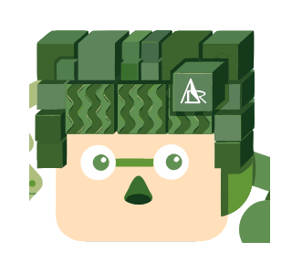
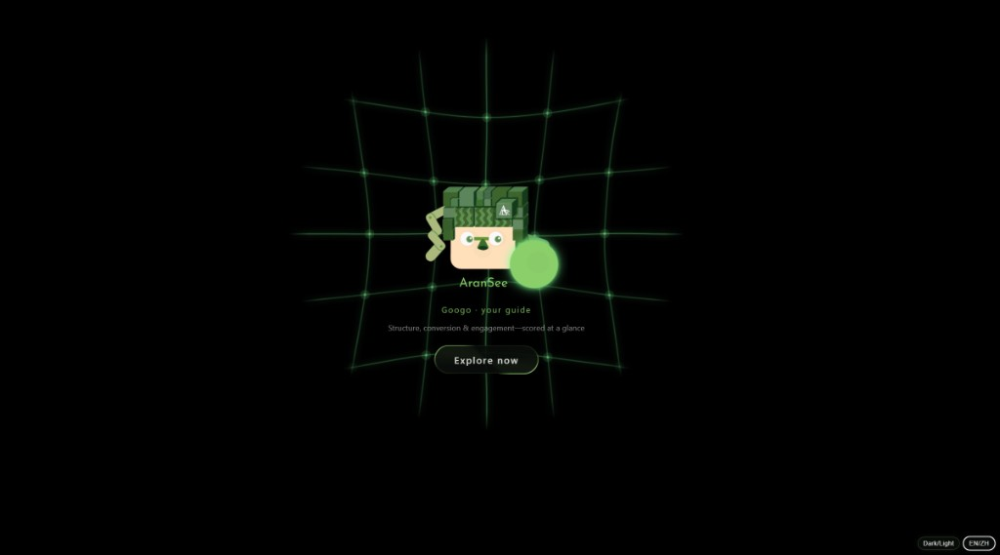
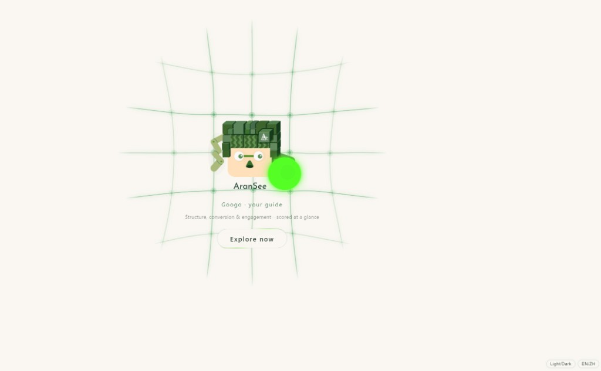
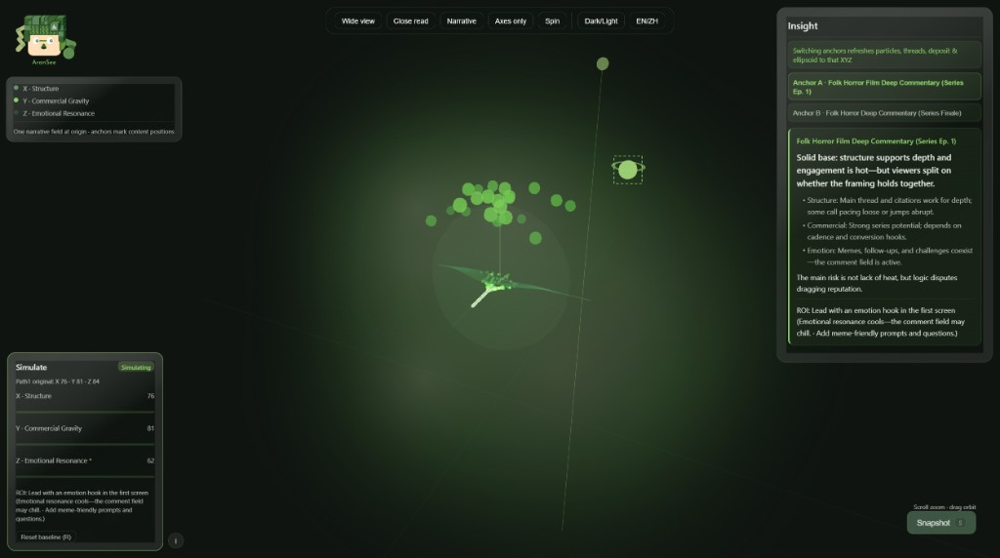
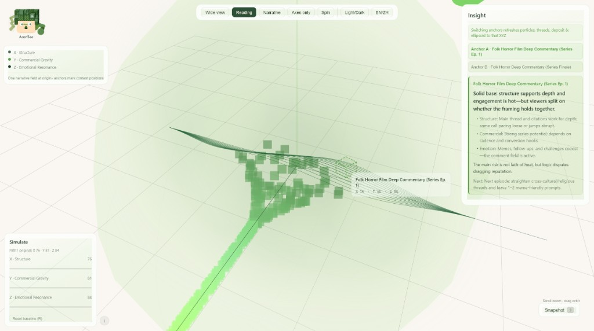
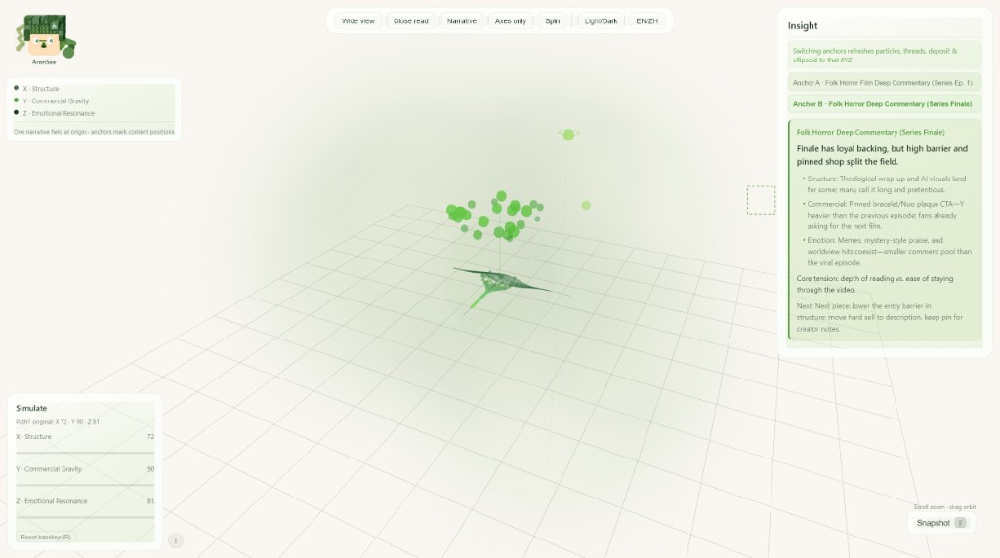

# AranSee_DataViz

<div align="right"><strong>中文</strong> · <a href="README.en.md">English</a></div>

<p align="center">
  
</p>

**AranSee** 是面向创作者的 **AI 内容诊断产品**：帖文与评论场 → **X/Y/Z 三轴判断**，可交互 **2.5D 沙盘**让落位一眼能看见。  
在 Cursor 以 Skill 安装——**AI 读懂打分**，**沙盘呈现模拟**；不是 Chat 长报告，也不是 Agent 型插件。

帮创作者针对**单条帖文 + 评论场**，完成结构 / 商业 / 情感落位、短洞察、策略模拟与 ROI 提示。

**AI 内容诊断** | **兼容 Cursor · Claude Code Skill** | **不是 Chat 长报告** | **分数驱动场域 · 可反复对照改稿**

<table align="center">
  <tr>
    <td align="center"></td>
    <td align="center"></td>
  </tr>
</table>

---

## 与其他 AI 分析工具有何不同

AranSee 把模型输出落成**协议化分数**，再驱动**确定性可视化**——不是留在对话框里的长报告。

1. **看得见** — 三轴空间里的落位：结构带、沉积场、共振流；不是段落里的一个抽象总分  
2. **评论场第二层** — 解说、带货类内容，评论类型往往比正文更省成本、更能说明场子  
3. **短而可执行** — 洞察 + 下一步 + ROI 一行，不做 PDF 式长报告  
4. **可对照改稿** — 同一份诊断反复进沙盘做策略模拟，看「某一轴变了，场子往哪偏」

---

## 适用人群

| 内容形态 | 你会看清什么 |
|----------|----------------|
| 深度解说 / 影评 | 结构是否稳、评论是追问还是玩梗 |
| 直播切片 / 情绪向 | 共鸣是否撑起传播、商业是否偏弱 |
| 清单干货 / 钩子向 | 结构带是否清晰、收藏动机来自哪一轴 |
| 收官带货 / 置顶转化 | 商业沉积是否加重、情感是否仍在线 |

> v1：**目前版本一次只处理一条帖**（每组 X/Y/Z 各 0–100）。公开展示含**系列双锚样例**（同系列两篇帖），仅作场层对比演示，**不代表 Skill 已开放系列批量诊断**；正式能力仍以单帖为主。展示案例取自**公开自媒体作品**（脱敏抽样）。

---

## 场域一览

<table align="center">
  <tr>
    <td align="center"></td>
    <td align="center"></td>
  </tr>
  <tr>
    <td align="center" colspan="2"><sub>暗色 · 三轴场 + 洞察卡 + 模拟 ROI · 系列锚点 A/B 切换</sub></td>
  </tr>
  <tr>
    <td align="center"></td>
    <td align="center"></td>
  </tr>
  <tr>
    <td align="center" colspan="2"><sub>亮色 · 近距读数 · 系列对比（收官锚点 B）</sub></td>
  </tr>
</table>

---

## 在线试玩

| 展示 | 链接 |
|------|------|
| **系列双锚（推荐）** | [立即探索](https://aranda-a.github.io/AranSee_DataViz/demos/folk_daoxi_series_01/aransee_sandbox.html) |
| 入口导航 | [对比数据系列探索](https://aranda-a.github.io/AranSee_DataViz/demos/) |

---

## 安装

### Cursor

克隆本仓库并在 Cursor 中打开；Agent 会读取 `AGENTS.md` 与 `SKILL.md`。

### Claude Code

```bash
cd ~/.claude/skills
git clone https://github.com/Aranda-a/AranSee_DataViz.git
```

其他支持 Skill 的工具：将本文件夹放到对应 skills 目录，保留 `prompts/` 与 `references/`。

---

## 使用

在对话中说明要复盘一条内容，粘贴帖文与评论摘要。Skill 按协议输出 `analysis.json`（三轴分数 + 短洞察 + 下一步）。

```
帮我用 AranSee 复盘这条解说：结构、商业、情感各落在哪？
【粘贴：视频摘要 + 代表性评论】
```

字段契约：[`docs/DATA_CONTRACT.md`](docs/DATA_CONTRACT.md)

---

## 数据与合规

自备数据（BYOD）；展示案例为脱敏样本，不含可复原链接与创作者真名。详见 [`docs/DATA_COMPLIANCE.md`](docs/DATA_COMPLIANCE.md)。

---

## 文档

| 路径 | 说明 |
|------|------|
| [`SKILL.md`](SKILL.md) | Skill 协议与三轴说明 |
| [`docs/BRAND.md`](docs/BRAND.md) | AranSee + Googo |
| [`docs/PRODUCT_AXES.md`](docs/PRODUCT_AXES.md) | 三轴定义 |
| [`release/github/MANIFEST.md`](release/github/MANIFEST.md) | 公开仓范围 |

---

## License

- **代码与 Skill 文档**：MIT — [`LICENSE`](LICENSE)
- **Googo 视觉资产**：© AranSee — 见 [`NOTICE.md`](NOTICE.md)
